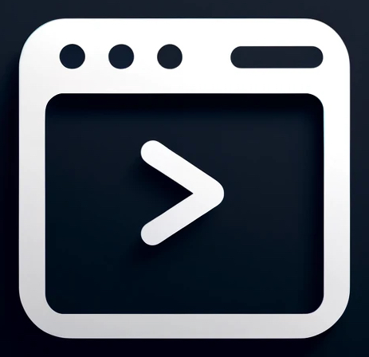

<!-- SHIELD SECTION -->
<div align="center">
    
    
    <br>
    
    
    
</div>

<!-- LOGO SECTION -->
<br />
<div align="center" id="readme-top">
  <a href="https://github.com/zumodeus/clip">
    
  </a>

  <h3 align="center">CLIP</h3>

  <p align="center">
    An amazing command-line interface parser for your CLI applications!
    <br />
    <a href="https://github.com/zumodeus/clip#how-it-works"><strong>See how it works »</strong></a>
    <br />
    <br />
    <a href="https://github.com/zumodeus/clip#installation">Installation</a>
    ·
    <a href="https://github.com/zumodeus/clip/issues/new?template=Bug+Report.yaml&title=[Bug]%3A+">Report Bug</a>
    ·
    <a href="https://github.com/zumodeus/clip/issues/new?template=New+Feature.yaml&title=[Feature]%3A+">Request Feature</a>
  </p>
</div>

<!-- TABLE OF CONTENTS -->
<div>
  <h4>Table of Contents</h4>
  <ul>
    <li>
      <a href="#getting-started">Getting Started</a>
      <ul>
        <li><a href="#prerequisites">Prerequisites</a></li>
        <li><a href="#installation">Installation</a></li>
      </ul>
    </li>
    <li><a href="#how-it-works">How it work</a></li>
    <li><a href="#usage">Usage</a></li>
    <li><a href="#contributing">Contributing</a></li>
    <li><a href="#license">License</a></li>
    <li><a href="#contact">Contact</a></li>
    <li><a href="#acknowledgments">Acknowledgments</a></li>
  </ul>
</div>

<!-- GETTING STARTED SECTION -->
## Getting Started

To start using this package in your project, you need to complete and follow these steps:

### Prerequisites

You may have installed [Go](https://go.dev/) on your machine, but if you haven't, here is a guide to [install](https://go.dev/doc/install) it.

### Installation

Once you have created and initialized your project, you can install this package by using the following command:

```sh
go get github.com/zumodeus/clip
```

<p align="right">[<a href="#readme-top">back to top</a>]</p>

<!-- HOW IT WORKS SECTION -->
## How It Works

**Command-Line Interface Parser** (aka **`CLIP`**) is a package that simplifies client interactions with terminal applications. By incorporating this package into your project, you will discover a faster and more efficient way to parse commands, streamline workflows, and enhance user experience.

This package contains three entities that will be parsed from the provided arguments, which are as follows:

1. **Command**: Represents the main action or function to be executed by the application. It typically dictates the overall behavior of the program.

2. **Option**: Refers to additional **flags**, **positional flags** or **parameter** that modify or add context to the behavior of the command. Options can be optional and are preceded by a hyphen (e.g., -v for verbose mode).

3. **Argument**: Represents the values that the command operates on or the values of a parameter (if it has been set).

For example, you set a command **example** and within it, you add an option that works as a parameter named **name** (short: **`-n`** & long: **`--name`**). Additionally, you add another option that acts as a flag, named **verbose** (short: **`-v`** & long: **`--verbose`**).

```sh
example --name world -v
# Example is the command
# --name is a parameter
# world is the argument (which will be the value for the --name parameter)
# -v is a flag
```

During the setup of the command, a handler function must be provided to the instantiator, as shown in the following example:

```go
func handlerExampleCommand(data *Holder) {
    name := "hello"
    if data, exists := data.GetParameterValue("name"); exists {
        name += " " + data
    }
    fmt.Printf("--name value is %s.\n", name)
    if verboseWasSet := data.HasFlag("verbose"); verboseWasSet {
        fmt.Println("--verbose was set.")
    }
}
```

When the parser completes its task, this function will be called with a struct containing the parsed data, but you can interact with it using just a few methods, which are listed as follows:

1. **`GetFlags()`**: Returns an array of strings containing the names of the set flags.

2. **`HasFlag(name string)`**: Checks if a flag (by its name) was set and returns a boolean value.

3. **`GetParameterValue(name string)`**: Retrieves the value assigned to a parameter and returns a tuple (string, bool).

4. **`GetParameterValues(name string)`**: Returns an array of strings that refers to all the arguments assigned to the same parameter.

5. **`GetArguments()`**: Returns all the arguments set for the command (excluding the values of the parameters).

Assuming the example function was called, your terminal output will resemble the following:

```sh
--name value is hello world.
--verbose was set.
```

**Here are some important considerations for using this package**:

1. **Order of Population**: The parser populates arguments by prioritizing undefined parameters before populating the command arguments.

2. **Multi-Short Options**: The parser supports interpreting multiple short options provided in a single instruction. For example, `example -nv world` will produce the same output as the previous example.

3. **Positional Flags**: If a positional flag is set, it will expect new parameters if required. For example, considering that **name** is a required parameter and **verbose** is a positional parameter, `example -v --name world` will not yield the same result as `example --name -v world` because **name** is a required parameter, and **verbose** creates a new context after its use. Therefore, the correct usage in this case will be `example --name world1 -v --name world2`.

4. **Error Catching**: An error catcher has been designed for this package. To implement it in your project, you can call this function right after the initialization of **CLIP**, as shown in the following code:

```go
package main

import (
    ...
    "github.com/zumodeus/clip"
    ...
)

func main() {
    app := GetCLIP(
        ...
    )

    defer app.ErrorCatcher()

    ....
}

```

<p align="right">[<a href="#readme-top">back to top</a>]</p>

<!-- USAGE SECTION -->
## Usage

Using the previous section as a first approach to this package, you now have the basics to create your own CLI application.

### Creating Entities

- **Commands**: To create a command, you will need to use a function called **`NewCommand`**, which requires several parameters that will be described as follows:

    ```go
    func NewCommand(
        name, short, long, description string,
        supports supports,
        handler func(*Holder),
    ) *command
    ```

    1. **name**: The name of the entity.

    2. **short**: The short reference of the entity.

    3. **long**: The long reference of the entity.

    4. **description**: The message that will be displayed when the help flag is triggered or an error is handled.

    5. **supports**: Indicates how many arguments the command can handle: **`NULL`**, **`STRING`** or **`STRINGS`**.

    6. **handler**: A function that will be called once the main task is completed.

    ```go
    exampleCommand := clip.NewCommand(
        "example",
        "e",
        "example",
        "This is the example command.",
        clip.NULL,
        handlerExampleCommand,
    )
    ```

- **Options**: To create a command, you will need to use a function called **`NewOption`**, which requires several parameters that will be described as follows:

    ```go
    func NewOption(
    	name, short, long, description string,
        kind kind,
        unique, required bool,
    ) *option
    ```

    **The first four parameters have the same meaning for both commands and options**.
    
    5. **kind**: It is the type of the option, which can take the values of **`FLAG`**, **`POSITIONAL_FLAG`** or **`PARAMETER`**.

    6. **unique**: If it takes the value of **`true`**, the option can be set only once; on the other hand, if it is **`false`**, the option can be set multiple times.

    7. **required**: If it takes the value of **`true`**, the option must be set; on the other hand, if it is **`false`**, the option is optional.

    ```go
    nameParameter := clip.NewOption(
        "name",
        "n",
        "name",
        "Set name for the example.",
        clip.PARAMETER,
        true,
        true,
    )

    verboseFlag := clip.NewOption(
        "verbose",
        "v",
        "verbose",
        "Set command to verbose mode.",
        clip.FLAG,
        false,
        false,
    )
    ```

    **Considerations for Options**:

    1. **Flags Can Exist Once Per Context**.

### Generate The **CLIP** Instance

To create a **CLIP** instance, you can use the function **`GetCLIP`** as shown in the following example:

```go
func GetCLIP(
	name, description string,
	defaultSupports supports,
	defaultHandler func(*Holder),
) *clip
```

1. **name**: It is the name of the application.

2. **description**: It is the main description of the application.

3. **defaultSupports**: Similar to the command's supports, it can take the same values.

4. **defaultHandler**: It is the default function that will be called when the main task is completed.

```go
package main

import (
    ...
    "github.com/zumodeus/clip"
    ...
)

func defaultHandler(data *Holder) {
    fmt.Println("default was called.")
}

func main() {
    app := clip.GetCLIP(
        "myApp",
        "My first CLI application.",
        clip.NULL,
        defaultHandler,
    )

    defer app.ErrorHandler()
}
```

### Adding Entities

There are two ways to add entities: directly into a command or into the root. Both cases will be demonstrated in the following example:

1. **Directly Into a Command**:

```go
exampleCommand.GetContainer().AddEntity(nameParameter) // Added name parameter into example command
exampleCommand.GetContainer().AddEntity(verboseFlag) // Added verbose flag into example command
```

2. **Into The Root**:

```go
app.GetContainer().AddEntity(exampleCommand) // Added exampleCommand into root
```

### Parse

Finally, to begin parsing the arguments, you can use the **`Parse`** function available once you instantiate **CLIP**.

```go
func (c *clip) Parse(args []string)
```

1. **args**: It can be an array of strings that you customize, or if you only need **CLIP** to parse arguments from the execution, set it to **`nil`**.

```go
app.Parse(nil) // We need to parse arguments from the execution
```

### Additionals

- **Custom Errors**: If you want or need to handle your own errors, you must use the **`NewException`** function available in the package, as shown in the following example:

```go
func NewException(
	typeof typeof,
	message string,
	command *command,
	shouldPrintHelp bool,
)
```

1. **typeof**: It is the type of error will be handled, the available values are: **`FATAL`**, **`MISSING`**, **`REQUIRED`**, **`NOT_FOUND`**, **`NOT_MATCH`**, **`DUPLICATE`** or **`INVALID_TYPE`**.
2. **message**: This is the error message.
3. **command**: This is the command associated with the error (optional).
4. **shouldPrintHelp**: If it is **`true`**, it will print the help output; otherwise, it will not.

```go
func handlerWithCustomException(data *Holder) {
    if data.HasFlag("verbose") {
        fmt.Println("Verbose was set.")
        return
    }

    clip.NewException(
        clip.MISSING,
        "Verbose needs to be set.",
        example,
        true,
    )
}
```

<p align="right">[<a href="#readme-top">back to top</a>]</p>

<!-- CONTRIBUTING SECTION -->
## Contributing

We welcome anyone who wants to contribute by adding a new feature or reporting a bug to be fixed. So, remember that any contribution to this open-source project will be greatly appreciated.

### Bug Report

If you find a bug that affects the functionality of the project, please follow the steps below:

1. Use the **`Bug Report`** template, available when you create an issue.
2. Provide a clear and descriptive title for the bug.
3. In the issue description, include step-by-step instructions to reproduce the bug.
4. Provide an email address for contact in case of any questions.
5. Finally, specify the version of the project and the operating system where the bug occurs.

### New Feature

If you would like to add a new feature to the project, please follow the steps below:

1. Use the **`New Feature`** template, available when you create an issue.
2. Provide a clear and descriptive title for the feature.
3. In the issue description, outline the purpose of the feature, its benefits, and any specific requirements or functionality you envision.
4. Provide an email address for contact in case of any questions.
5. Finally, specify if this feature involves a **`MAJOR`** or **`MINOR`** change of version.

### Pull Request

1. **Fork the repository**: Click the "Fork" button on the repository page to create a copy of the repository on your GitHub account.

2. **Clone your fork**: Use `git clone` to clone your forked repository to your local machine.

3. **Create a new branch**: Use `git checkout -b feature/YourFeatureName` for a new feature or `git checkout -b fix/YourBugFix` for a bug fix.

4. **Make your changes**: Implement your feature or bug fix.

5. **Commit your changes**: Use clear and concise commit messages. Follow the conventional commits style (e.g., `feature: add new parsing method` or `fix: resolve issue with parameter validation`).

6. **Push your changes**: Push your changes to your forked repository.

7. **Open a pull request**: Navigate to the original repository and open a pull request targeting the `master` branch.
    - The title must follow the pattern `[MAJOR | MINOR | PATCH] [feature | fix | docs]: [BRIEF DESCRIPTION]` (e.g., `[MAJOR] feature: added entities, add-ons and parser functionalities for the first version.`).
    - Provide a detailed description of your changes and link any related issues.
    - Provide an email address for contact in case of any questions.
    - Explain the rationale behind your changes and how they improve the project or fix the bug.
    - If applicable, include any relevant screenshots, examples, or documentation updates that demonstrate your changes.
    - Ensure your code follows the project's coding standards and has been tested thoroughly.
    - If your changes are related to an existing issue, reference it in the pull request description (e.g., "Fixes #123").

### After Creating Pull Request

Once you have submitted your pull request, the project maintainers will review your changes. Here are the steps to follow in case any issues arise during the review process:

1. Monitor Feedback: Keep an eye on the pull request comments for any feedback or requests for changes from the maintainers. They may ask for additional modifications or clarifications.

2. Address Review Comments:
    - If there are requested changes, make the necessary adjustments in your local branch.
    - After making changes, commit them with clear messages that indicate what you have modified (e.g., `fix: correct typo in documentation`).
    - Push the changes to your forked repository using `git push origin your-branch-name`. The pull request will automatically update with your latest changes.

3. Respond to Questions: If maintainers ask questions or require clarification, provide prompt and thorough responses to facilitate the review process.

4. Check for Merge Conflicts: If there are merge conflicts with the base branch, you may need to resolve them:
    - Fetch the latest changes from the original repository.
    - Merge those changes into your branch using `git merge upstream master`.
    - Resolve any conflicts, commit the changes, and push again.

5. Be Patient: Remember that maintainers are often busy with multiple contributions. It may take some time for them to review your pull request.

6. Final Review and Merge: Once all issues are resolved and the maintainers are satisfied with your changes, they will merge your pull request into the main codebase. You may receive a notification when this occurs.

7. Celebrate Your Contribution: Congratulations! Your contribution is now part of the project. Feel free to update your local repository to keep it in sync with the main repository using `git pull upstream master`.

### Top contributors:

<a href="https://github.com/zumodeus/clip/graphs/contributors">
  
</a>

<p align="right">[<a href="#readme-top">back to top</a>]</p>

<!-- LICENSE SECTION -->
## License

This open-source project is licensed under the MIT License. You can view the license [here](LICENSE).

<p align="right">[<a href="#readme-top">back to top</a>]</p>

<!-- CONTACT SECTION -->
## Contact

If you have any questions, please contact the current maintainer of this project, [**`zumodeus`**](mailto:zumodeus@gmail.com).

<!-- VARIABLES SECTION -->
[contributors-shield]: https://img.shields.io/?style=for-the-badge
[contributors-url]: https://github.com/zumodeus/clip/graphs/contributors
